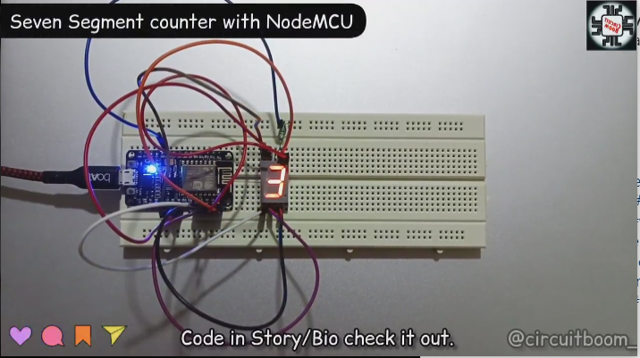
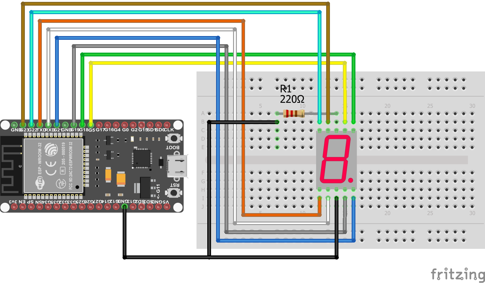

# Seven-Segment-counter-using-Node-MCU
A simple counter using seven segmment **LED** and **NodeMCU (ESP8266)**.
 
### Actual representation of the project :rocket:
------------------

### Circuit Diagram for reference
------------------

**For more reference** [Click Here](https://www.instagram.com/circuitboom_/)
